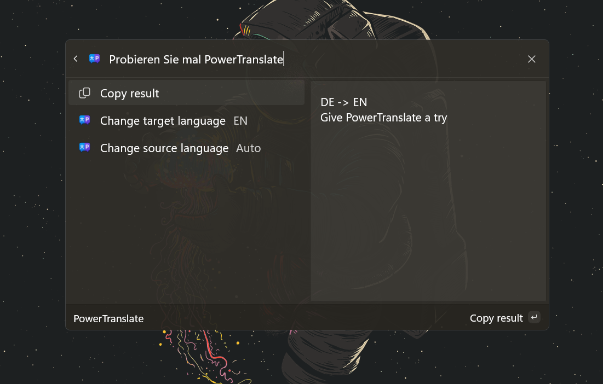
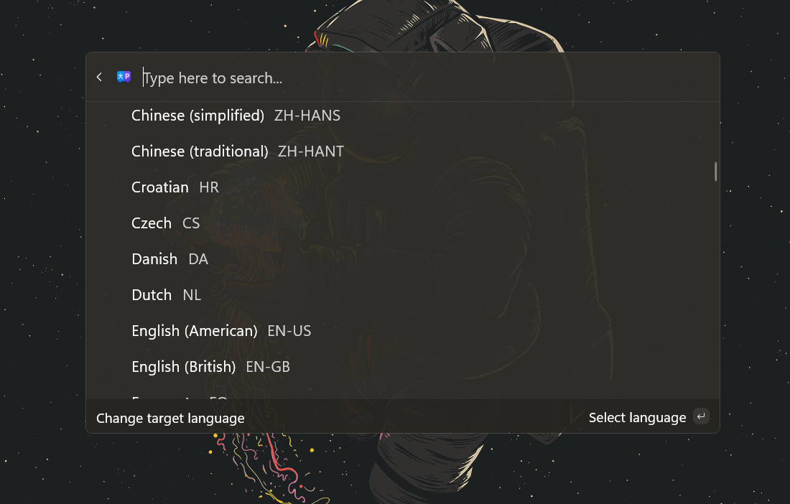
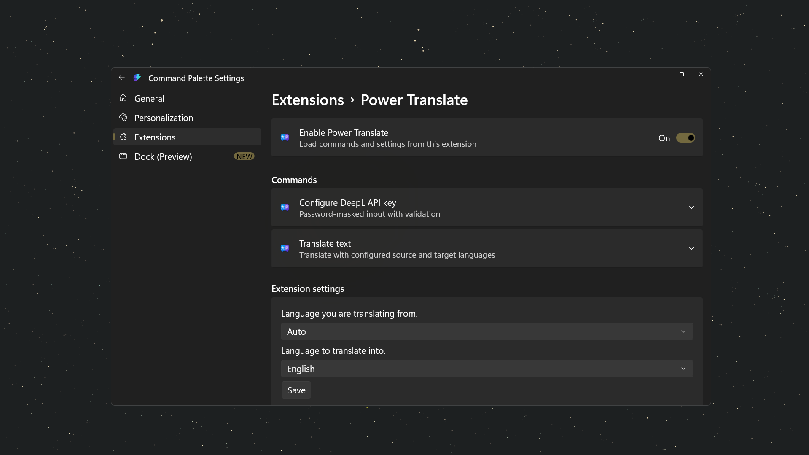

# PowerTranslate Extension

<p align="center">
 
</p>

A lightweight translation extension for Microsoft PowerToys Command Palette via DeepL API.

## Overview

PowerTranslate brings fast, accurate translation directly into your PowerToys Command Palette workflow. Open the Command Palette, search for "Translate", and instantly translate text between 30+ language pairs using DeepL's industry-leading neural translation engine.

## Requirements

- **OS**: Windows 10 Build 19041 or later, or Windows 11
- **PowerToys**: Latest version with Command Palette support from [Microsoft PowerToys on GitHub](https://github.com/microsoft/PowerToys)
- **Command Palette**: Enabled inside PowerToys; see the [Command Palette section in the PowerToys GitHub repo](https://github.com/microsoft/PowerToys#-utilities)
- **.NET**: .NET 9.0 (included in packaged app)
- **DeepL API Key**: Free or paid account at [deepl.com](https://www.deepl.com/docs-api/accessing-the-api)
- **Architecture**: x64 (AMD64) only
- **Windows 10 S**: Not supported (desktop full-trust extension model)

## Installation

### From Winget (Recommended)

_Coming soon_

### From Microsoft Store (Recommended)

_Coming soon_

### Manual Installation (Release package)

> **Important**: Windows 10 S is not supported.

1. Open the [latest GitHub release](https://github.com/lamteteeow/PowerTranslate/releases/latest) and download the signed Release package assets.
2. Install or update [PowerToys from GitHub](https://github.com/microsoft/PowerToys) and make sure [Command Palette](https://github.com/microsoft/PowerToys#-utilities) is enabled.
3. Import the certificate in PowerShell:

 ```powershell
 Import-Certificate -FilePath ".\\<downloaded-package>.cer" -CertStoreLocation "Cert:\\CurrentUser\\TrustedPeople"
 ```

1. Install the package in PowerShell:

 ```powershell
 Add-AppxPackage -Path ".\\<downloaded-package>.msix" -ForceUpdateFromAnyVersion
 ```

1. Open PowerToys Command Palette and run `Reload Command Palette extensions`.

## How It Works

1. Open PowerToys Command Palette
2. Type "Translate" to access translation commands
3. Configure your DeepL API key (one-time setup)
4. Select or leave source language as AUTO for automatic detection
5. Choose target language
6. Enter text to translate
7. View results with automatic copy-to-clipboard support
8. Change languages on-the-fly without re-entering text

## Screenshots

### Translation UI



### Language Selection



### Settings Page



## Configuration

After installation, use the "Configure DeepL API key" command in the palette to:
- Enter your DeepL API key (get one at [deepl.com](https://www.deepl.com/docs-api/accessing-the-api))
- Validate connectivity to the DeepL API
- Save encrypted key for future use

> **Note**: After setting the API key, reload Command Palette extensions to refresh language choices. Use `Ctrl+Shift+P` and search "Reload Command Palette extensions".

## Troubleshooting

**Languages not loading?**
- Verify your DeepL API key is valid: use "Configure DeepL API key" command
- Check your internet connection
- Ensure you've reloaded Command Palette extensions after saving API key

**Translation not working?**
- Check API key validity (free accounts have usage limits)
- Verify internet connectivity
- Try a different language pair to isolate the issue

**Settings not persisting?**
- Settings are cached in: `C:\Users\[User]\AppData\Local\Packages\PowerTranslateExtension_8wekyb3d8bbwe\LocalCache\Local\PowerTranslateExtension\`
- Verify folder exists and is accessible
- Clear cache files if corrupted: `deepl.key`, `source-language.txt`, `target-language.txt`

**API key not saving?**
- Ensure API key is not empty
- Verify Windows can encrypt data (Windows Data Protection API must be available)
- Run "Configure DeepL API key" command and try again

**Install blocked with same-version content mismatch (`0x80073CFB`)?**
- This happens when a package with the same identity/version was built from different contents (for example Debug vs Release).
- Remove existing package, then install the signed Release package again:

 ```powershell
 Get-AppxPackage -Name "lamteteeow.PowerTranslate" | Remove-AppxPackage
 Add-AppxPackage -Path ".\\<downloaded-package>.msix"
 ```

## Privacy

See [PRIVACY.md](PRIVACY.md) for the formal policy used for release and store submission.

### Data Handling

- **Translation requests**: Sent to DeepL API servers over HTTPS
- **API key**: Stored locally and encrypted using Windows Data Protection API
- **Language preferences**: Stored locally in plain text (no sensitive data)
- **No telemetry**: No usage data, tracking, or analytics collected

### Data Stored Locally

- Encrypted API key (_not_ accessible outside secure storage)
- Selected source language
- Selected target language

### External Communication

- Only communicates with DeepL API for translation requests
- No communication with Microsoft or PowerToys telemetry systems beyond Command Palette discovery

### GDPR/CCPA Compliance

- No personal data collected or stored
- No third-party tracking
- Users have full control over API key and language settings

## Development Status

**Status**: Stable v1.1.1.0 release

Core translation functionality, language selection, and settings persistence are production-ready. Windows 10/11 support verified.

### Architecture Validation

- **x64 (Windows host)**: Build, package, install, and extension startup verified.
- **ARM64 support**: Not targeted in this release.
- **Windows 10 S support**: Not supported in this release.

## Contributing

Contributions are welcome! Whether it's bug fixes, feature requests, documentation improvements, or translations, we'd love your help.

> **Disclaimer**: The author is inexperienced with common open-source standards and conventions. We greatly appreciate feedback, code reviews, and guidance from experienced contributors.

Please see [CONTRIBUTING.md](CONTRIBUTING.md) for guidelines.

## License

MIT License - See [LICENSE](LICENSE) file for details.

This software is provided "AS IS" without warranty of any kind. The author assumes no liability for any damages, data loss, or issues arising from use of this extension.
